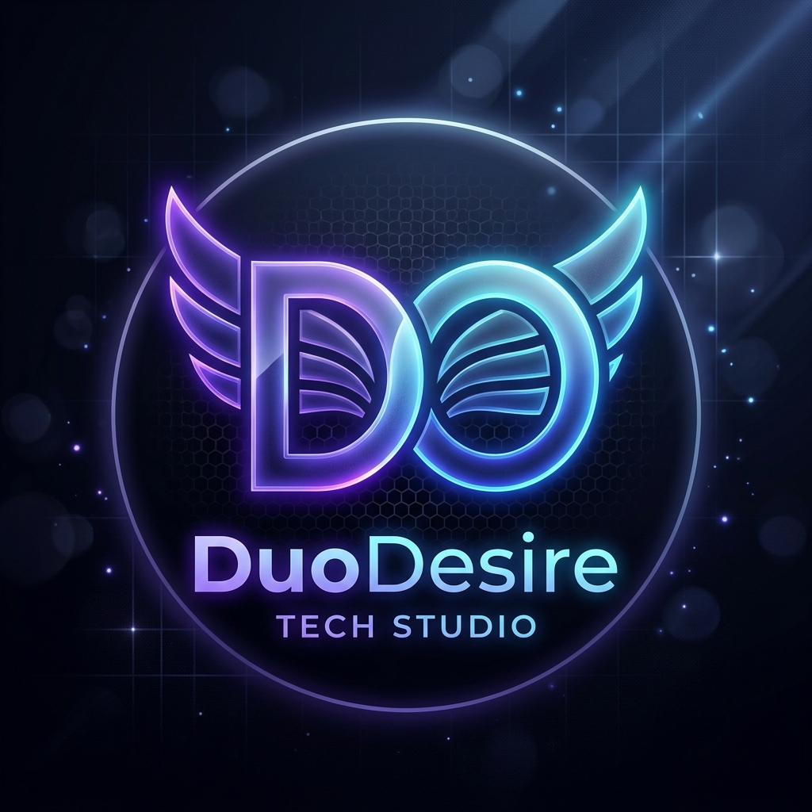

# ✨ DuoDesire

### *Parent Studio & Technology Incubator for the Nirox Startup Ecosystem*

 

> **DuoDesire** is the parent technology studio dedicated to researching, incubating, and engineering state-of-the-art mobile products, AI workflows, and digital consumer ecosystems for **Nirox**.

 

---

### 🚀 Flagship Portfolio & Incubated Ventures

<table>
  <thead>
    <tr>
      <th width="28%">Product</th>
      <th width="42%">Core Innovation</th>
      <th width="30%">Ecosystem Role</th>
    </tr>
  </thead>
  <tbody>
    <tr>
      <td><b>👶 BabyBloom</b></td>
      <td>Smart parenting companion with pediatric growth trackers, milestone analytics & AI insights.</td>
      <td>Family & Health Technology</td>
    </tr>
    <tr>
      <td><b>⏰ Auralarm</b></td>
      <td>Intelligent morning audio experience with interactive wake missions (math, puzzle, shake) and sleep wellness.</td>
      <td>Productivity & Lifestyle</td>
    </tr>
    <tr>
      <td><b>👗 Formality</b></td>
      <td>Smart wardrobe management, outfit planner, formality tier classification, and weather intelligence.</td>
      <td>FashionTech & Smart Wear</td>
    </tr>
    <tr>
      <td><b>⌚ Watch-Verse</b></td>
      <td>Immersive luxury timepiece marketplace featuring virtual discovery, seller hubs, and AR try-on.</td>
      <td>Luxury E-Commerce & AR</td>
    </tr>
    <tr>
      <td><b>🛠️ Watch Admin Panel</b></td>
      <td>Operations engine powering real-time seller verification, dispute arbitration, and platform analytics.</td>
      <td>Enterprise Infrastructure</td>
    </tr>
  </tbody>
</table>

---

### 🔬 Engineering & Design Philosophy

- **Zero Compromise UX/UI:** Fluid 60fps micro-animations, tailored glassmorphism, and intuitive human ergonomics.
- **Offline-First Resilience:** Local database caches (Hive, SQLite) synchronized effortlessly with cloud backends.
- **Rigorous Reliability:** Comprehensive testing pipelines with unit, widget, and integration coverage.
- **Privacy & Security First:** End-to-end data integrity adhering to international security standards.

---

  © DuoDesire • Nirox Startup Ecosystem. All rights reserved.

